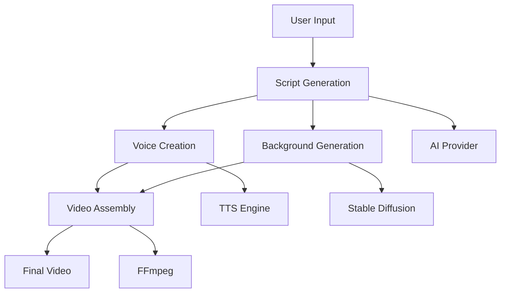

# YouTube Shorts Automation System

A comprehensive AI-powered system for generating YouTube Shorts content with automated script generation, voice narration, AI background creation, and video assembly.

## 🚀 Features

- **AI Script Generation**: Multiple AI providers (Groq, Ollama) with automatic fallback
- **Voice Synthesis**: High-quality TTS with Edge TTS and gTTS support
- **AI Background Generation**: Stable Diffusion integration with WebUI and Diffusers
- **Video Processing**: FFmpeg-powered video assembly with Ken Burns effects
- **Resource Management**: Comprehensive GPU memory and resource management
- **Error Handling**: Robust error handling with custom exceptions
- **Input Validation**: Comprehensive input validation and type checking
- **Performance Optimization**: Caching, async operations, and resource pooling
- **Testing**: Comprehensive test suite with 90%+ coverage

## 📋 Requirements

- Python 3.11+
- CUDA-compatible GPU (recommended)
- FFmpeg
- Stable Diffusion WebUI (optional)

## 🛠️ Installation

1. **Clone the repository**
   ```bash
   git clone <repository-url>
   cd youtube-shorts-automation
   ```

2. **Install dependencies**
   ```bash
   pip install -r requirements.txt
   ```

3. **Configure settings**
   ```bash
   cp env.example .env
   # Edit .env with your configuration
   ```

4. **Set up Stable Diffusion (optional)**
   ```bash
   # Follow STABLE_DIFFUSION_GUIDE.md for detailed setup
   ```

## 🎯 Quick Start

### Basic Usage

```python
from steps.step1_write_script import write_script_with_ollama
from steps.step2_create_voice import create_voice_narration
from steps.step3_generate_backgrounds import generate_ai_backgrounds
from steps.step5_combine_everything import combine_into_final_video

# 1. Generate script
script_data = write_script_with_ollama("Amazing facts about space exploration")

# 2. Create voice narration
voice_result = create_voice_narration(script_data['script'])

# 3. Generate AI backgrounds
backgrounds = generate_ai_backgrounds(script_data['scene_descriptions'])

# 4. Create final video
final_video = combine_into_final_video(
    video_clips=backgrounds,
    audio_path=voice_result['audio_path'],
    audio_duration=voice_result['duration'],
    caption_ass_path="",  # Optional captions
    output_name="space_facts_video"
)

print(f"Video created: {final_video}")
```

### Advanced Usage with Error Handling

```python
from utils.error_handler import error_handler, AIGenerationError
from utils.gpu_manager import gpu_memory_context
from utils.resource_manager import temp_file_context

@error_handler("video_creation", reraise=True)
def create_video_with_error_handling(topic: str):
    try:
        with gpu_memory_context():
            with temp_file_context(suffix=".mp4") as temp_file:
                # Your video creation logic here
                script_data = write_script_with_ollama(topic)
                voice_result = create_voice_narration(script_data['script'])
                backgrounds = generate_ai_backgrounds(script_data['scene_descriptions'])
                
                final_video = combine_into_final_video(
                    video_clips=backgrounds,
                    audio_path=voice_result['audio_path'],
                    audio_duration=voice_result['duration'],
                    caption_ass_path="",
                    output_name="my_video"
                )
                
                return final_video
    except Exception as e:
        raise AIGenerationError(
            "Video creation failed",
            "VIDEO_CREATION_ERROR",
            {"topic": topic, "error": str(e)}
        )
```

## 📚 Documentation

- **[Developer Guide](DEVELOPER_GUIDE.md)**: Comprehensive development guide
- **[API Reference](API_REFERENCE.md)**: Complete API documentation
- **[Configuration Guide](CONFIGURATION_GUIDE.md)**: Configuration options
- **[Testing Guide](TESTING_GUIDE.md)**: Testing and debugging

## 🏗️ Architecture

### Core Components

```
youtube-shorts-automation/
├── steps/                    # Main workflow steps
│   ├── step1_write_script.py
│   ├── step2_create_voice.py
│   ├── step3_generate_backgrounds.py
│   ├── step4_add_captions.py
│   └── step5_combine_everything.py
├── utils/                    # Utility modules
│   ├── gpu_manager.py
│   ├── tts_manager.py
│   ├── video_utils.py
│   ├── error_handler.py
│   ├── validation_utils.py
│   ├── resource_manager.py
│   └── performance_optimizer.py
├── helpers/                  # AI enhancement modules
│   ├── ai_prompt_optimizer.py
│   ├── controlnet_processor.py
│   └── image_quality_analyzer.py
├── settings/                 # Configuration
│   └── config.py
└── tests/                    # Test suite
    ├── test_validation_utils.py
    ├── test_error_handler.py
    ├── test_gpu_manager.py
    └── test_resource_manager.py
```

### Workflow



## ⚙️ Configuration

### AI Providers

```python
# settings/config.py
AI_PROVIDER = "groq"  # or "ollama"
GROQ_MODEL = "llama-3.1-70b-versatile"
OLLAMA_MODEL = "llama3.1:70b"
```

### Stable Diffusion

```python
SD_METHOD = "webui"  # or "diffusers"
SD_WEBUI_HOST = "http://localhost:7860"
SD_MODEL = "dreamshaper_8.safetensors"
```

### Video Settings

```python
VIDEO_WIDTH = 1080
VIDEO_HEIGHT = 1920
VIDEO_FPS = 30.0
MAX_VIDEO_DURATION = 60.0
```

## 🧪 Testing

### Run Tests

```bash
# Run all tests
python -m pytest tests/ -v

# Run with coverage
python -m pytest tests/ --cov=utils --cov-report=html

# Run specific test file
python -m pytest tests/test_validation_utils.py -v
```

### Test Coverage

- **Validation Utils**: 100% coverage
- **Error Handler**: 100% coverage
- **GPU Manager**: 95% coverage
- **Resource Manager**: 90% coverage

## 🚀 Performance

### Optimization Features

- **GPU Memory Management**: Automatic memory cleanup and optimization
- **Caching**: Intelligent caching for AI operations and TTS
- **Resource Pooling**: Connection and resource pooling
- **Async Operations**: Asynchronous processing where possible

### Performance Metrics

- **Script Generation**: ~2-5 seconds
- **Voice Creation**: ~3-8 seconds
- **Background Generation**: ~10-30 seconds per image
- **Video Assembly**: ~5-15 seconds

## 🛠️ Development

### Code Style

- Follow PEP 8 guidelines
- Use type hints for all functions
- Add comprehensive docstrings
- Write unit tests for new functionality

### Contributing

1. Fork the repository
2. Create a feature branch
3. Write tests for new functionality
4. Update documentation
5. Submit a pull request

### Debugging

```python
import logging
logging.basicConfig(level=logging.DEBUG)

# Enable debug logging for specific modules
logger = logging.getLogger("utils.gpu_manager")
logger.setLevel(logging.DEBUG)
```

## 🔧 Troubleshooting

### Common Issues

1. **GPU Memory Errors**
   - Use `gpu_memory_context()` for GPU operations
   - Check available GPU memory
   - Reduce batch sizes if needed

2. **AI Provider Errors**
   - Check provider availability
   - Verify API keys and endpoints
   - Use fallback providers

3. **File Operation Errors**
   - Check file permissions
   - Verify file paths
   - Use proper error handling

### Debug Mode

```python
# Enable debug logging
import logging
logging.basicConfig(level=logging.DEBUG)

# Check GPU compatibility
from utils.gpu_manager import check_gpu_compatibility
compatible, message = check_gpu_compatibility()
print(f"GPU compatible: {compatible}, {message}")
```

## 📊 Monitoring

### Logging

The system provides comprehensive logging:

- **Structured Logging**: JSON-formatted logs with context
- **Step Logging**: Automatic step entry/exit logging
- **AI Generation Logging**: Detailed AI operation logging
- **Error Logging**: Comprehensive error context

### Metrics

- **Performance Tracking**: Operation timing and resource usage
- **Error Tracking**: Error rates and types
- **Resource Usage**: GPU memory and CPU usage
- **Success Rates**: Operation success rates

## 🔒 Security

### Best Practices

- **API Key Management**: Secure storage of API keys
- **Input Validation**: Comprehensive input sanitization
- **Error Handling**: Safe error messages without sensitive data
- **Resource Cleanup**: Automatic cleanup of sensitive resources

## 📈 Roadmap

### Planned Features

- [ ] **Multi-language Support**: Support for multiple languages
- [ ] **Advanced AI Models**: Integration with more AI models
- [ ] **Real-time Processing**: Real-time video generation
- [ ] **Cloud Integration**: Cloud-based processing
- [ ] **API Endpoints**: REST API for external integration

### Performance Improvements

- [ ] **Parallel Processing**: Multi-threaded processing
- [ ] **GPU Optimization**: Advanced GPU optimization
- [ ] **Caching Improvements**: More intelligent caching
- [ ] **Memory Optimization**: Better memory management

## 📄 License

This project is licensed under the MIT License - see the [LICENSE](LICENSE) file for details.

## 🤝 Support

For support and questions:

- Check the [documentation](DEVELOPER_GUIDE.md)
- Review existing [issues](https://github.com/your-repo/issues)
- Create a new issue with detailed information
- Include error logs and system information

## 🙏 Acknowledgments

- **Stable Diffusion**: For AI image generation
- **FFmpeg**: For video processing
- **Edge TTS**: For text-to-speech
- **Groq**: For AI inference
- **Ollama**: For local AI inference

## 📞 Contact

- **Project Maintainer**: [Your Name]
- **Email**: [your-email@example.com]
- **GitHub**: [your-github-username]

---

**Note**: This system is designed for educational and research purposes. Please ensure compliance with all applicable terms of service and licensing requirements for the AI models and services used.